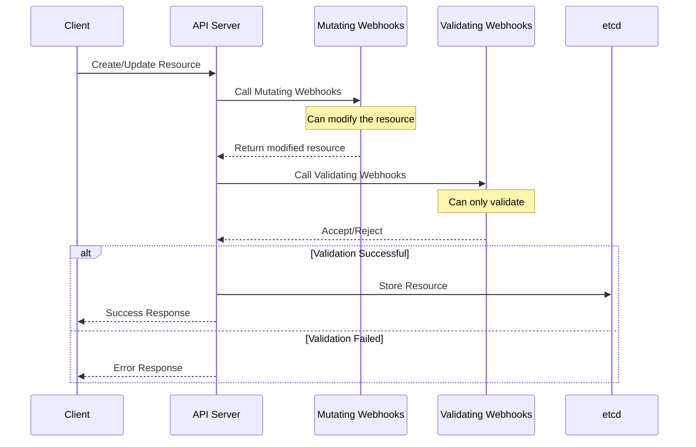

# Webhooks

Webhooks in Kubernetes allow you to intercept and modify requests to the API server. KubeOps supports three types of webhooks:

- Validation Webhooks: Validate resources before they are created or updated
- Mutation Webhooks: Modify resources before they are stored
- Conversion Webhooks: Convert between different versions of your custom resources

:::warning Web Version Required
Webhooks require the web version of KubeOps (`KubeOps.Operator.Web`) as they need to expose HTTP endpoints. This introduces additional dependencies on ASP.NET Core.
:::

## Webhook Flow

When a request comes to the Kubernetes API server, it goes through several admission controllers. Here's how webhooks fit into this flow:



The sequence shows that:

1. Mutation webhooks run first and can modify the resource
2. Validation webhooks run after mutations and can only validate
3. The resource is only stored if all validations pass

## Local Development Considerations

For local development, your operator must be accessible from the Kubernetes cluster via HTTPS. There are several ways to achieve this:

1. Certificate Provider (Recommended):

   - Uses a certificate manager to generate valid certificates
   - Most reliable and secure option
   - Requires proper certificate configuration

2. Local Development Tools:
   - ngrok
   - Telepresence
   - Custom reverse proxy solutions

:::danger LocalTunnel Deprecated
The LocalTunnel option is deprecated due to stability issues. It's recommended to use the certificate provider or other more reliable solutions.
:::

## Validation Webhooks

Validation webhooks allow you to enforce custom validation rules for your resources. They are called before a resource is created or updated.

```csharp
[ValidationWebhook(typeof(V1DemoEntity))]
public class DemoValidationWebhook : ValidationWebhook<V1DemoEntity>
{
    public override ValidationResult Create(V1DemoEntity entity, bool dryRun)
    {
        if (entity.Spec.Username == "forbidden")
        {
            return Fail("Username may not be 'forbidden'.", 422);
        }

        return Success();
    }

    public override ValidationResult Update(
        V1DemoEntity oldEntity,
        V1DemoEntity newEntity,
        bool dryRun)
    {
        if (newEntity.Spec.Username == "forbidden")
        {
            return Fail("Username may not be 'forbidden'.");
        }

        return Success();
    }
}
```

## Mutation Webhooks

Mutation webhooks allow you to modify resources before they are stored. They are called before validation webhooks.

```csharp
[MutationWebhook(typeof(V1DemoEntity))]
public class DemoMutationWebhook : MutationWebhook<V1DemoEntity>
{
    public override MutationResult<V1DemoEntity> Create(
        V1DemoEntity entity,
        bool dryRun)
    {
        if (entity.Spec.Username == "overwrite")
        {
            entity.Spec.Username = "random overwritten";
            return Modified(entity);
        }

        return NoChanges();
    }
}
```

## Conversion Webhooks

:::warning Preview Feature
Conversion webhooks are currently in preview. The API is not stable and may change in future versions.
:::

To enable preview features, add the following to your project file:

```xml title="MyOperator.csproj"
<PropertyGroup>
    <EnablePreviewFeatures>true</EnablePreviewFeatures>
</PropertyGroup>
```

### Understanding Conversion Webhooks

Conversion webhooks are used to convert between different versions of your custom resources. They are essential when:

- You have multiple versions of your CRD
- You need to maintain backward compatibility
- You want to evolve your API without breaking existing clients

The storage version is the version that Kubernetes uses to store your resources. All other versions must be able to convert to and from the storage version.

### Implementing Conversion Webhooks

```csharp
[ConversionWebhook(typeof(V3DemoEntity))]
public class DemoConversionWebhook : ConversionWebhook<V3DemoEntity>
{
    protected override IEnumerable<IEntityConverter<V3DemoEntity>> Converters =>
        new IEntityConverter<V3DemoEntity>[]
        {
            new V1ToV3(),
            new V2ToV3(),
        };

    private class V1ToV3 : IEntityConverter<V1DemoEntity, V3DemoEntity>
    {
        public V3DemoEntity Convert(V1DemoEntity from)
        {
            var nameSplit = from.Spec.Name.Split(' ');
            var result = new V3DemoEntity { Metadata = from.Metadata };
            result.Spec.Firstname = nameSplit[0];
            result.Spec.Lastname = string.Join(' ', nameSplit[1..]);
            return result;
        }

        public V1DemoEntity Revert(V3DemoEntity to)
        {
            var result = new V1DemoEntity { Metadata = to.Metadata };
            result.Spec.Name = $"{to.Spec.Firstname} {to.Spec.Lastname}";
            return result;
        }
    }

    private class V2ToV3 : IEntityConverter<V2DemoEntity, V3DemoEntity>
    {
        public V3DemoEntity Convert(V2DemoEntity from)
        {
            var result = new V3DemoEntity { Metadata = from.Metadata };
            result.Spec.Firstname = from.Spec.Firstname;
            result.Spec.Lastname = from.Spec.Lastname;
            return result;
        }

        public V2DemoEntity Revert(V3DemoEntity to)
        {
            var result = new V2DemoEntity { Metadata = to.Metadata };
            result.Spec.Firstname = to.Spec.Firstname;
            result.Spec.Lastname = to.Spec.Lastname;
            return result;
        }
    }
}
```

### Important Considerations for Conversion Webhooks

1. **Complete Conversion Path**:

   - All versions must be able to convert to and from the storage version
   - Missing conversions will cause errors when accessing resources

2. **Data Loss**:

   - Be careful when converting between versions
   - Some data might be lost when converting back and forth
   - Consider adding validation to prevent data loss

3. **Storage Version**:

   - Choose a stable version as your storage version
   - The storage version should be able to represent all data from other versions
   - Use the `[StorageVersion]` attribute to mark the storage version

4. **Testing**:
   - Test conversions in both directions
   - Verify that no data is lost
   - Test with real-world data scenarios

## Best Practices

1. **Validation Webhooks**:

   - Keep validation rules simple and focused
   - Return clear error messages
   - Consider using the `dryRun` parameter for testing

2. **Mutation Webhooks**:

   - Make minimal necessary changes
   - Document all mutations
   - Consider the impact on validation

3. **Conversion Webhooks**:
   - Implement bidirectional conversions
   - Handle all fields explicitly
   - Add validation to prevent data loss
   - Test conversions thoroughly

## Common Pitfalls

1. **Validation**:

   - Overly complex validation rules
   - Missing validation for critical fields
   - Inconsistent error messages

2. **Mutation**:

   - Unintended side effects
   - Missing validation after mutation
   - Inconsistent mutations

3. **Conversion**:
   - Incomplete conversion paths
   - Data loss during conversion
   - Missing validation
   - Incorrect storage version selection
