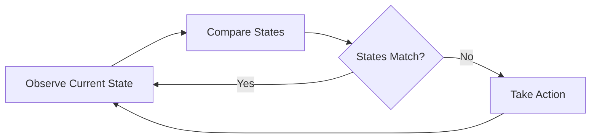

# Introduction to KubeOps

Welcome to KubeOps, the SDK for building [Kubernetes Operators](https://kubernetes.io/docs/concepts/extend-kubernetes/operator/) with [.NET](https://dotnet.microsoft.com/)!

## What is Kubernetes?

Kubernetes is an open-source container orchestration platform that automates the deployment, scaling, and management of containerized applications. It provides a robust framework for running distributed systems resiliently, handling container scheduling, load balancing, and self-healing capabilities.

## Understanding Kubernetes Operators

Kubernetes Operators are application-specific controllers that extend the Kubernetes API to create, configure, and manage instances of complex applications. They follow the Kubernetes control loop pattern and are designed to automate operational tasks that would typically require human intervention.

### The Reconciliation Loop

The reconciliation loop is a fundamental concept in Kubernetes Operators. It works as follows:

1. **Observe**: The operator observes the current state of the cluster and the desired state defined in custom resources
2. **Compare**: It compares the current state with the desired state
3. **Act**: If there's a difference, the operator takes action to reconcile the current state with the desired state
4. **Repeat**: This process continues indefinitely, ensuring the system maintains the desired state

## Why KubeOps?

KubeOps was created to bring the power of .NET to Kubernetes Operator development. While Go is the traditional language for Kubernetes development, .NET offers several advantages:

- **Rich Language Features**: C# provides powerful features like LINQ, async/await, and strong typing
- **Familiar Ecosystem**: .NET developers can leverage their existing knowledge and tools
- **Modern Development Experience**: Access to modern IDE features, debugging capabilities, and testing frameworks
- **Enterprise Integration**: Seamless integration with existing .NET-based enterprise systems

## Getting Started

To start building your own Kubernetes Operator with KubeOps, you'll need:

- .NET 8.0 or later
- A Kubernetes cluster (local or remote)
- Basic understanding of Kubernetes concepts

The next sections will guide you through setting up your development environment and creating your first operator with KubeOps.
